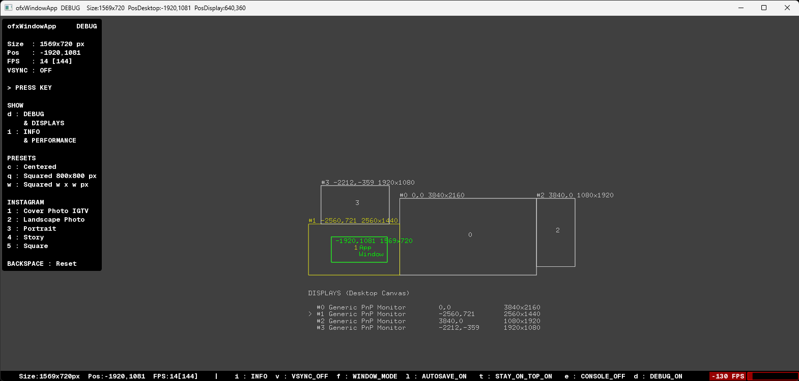

# ofxWindowApp

## Screenshot


## OVERVIEW
**openFrameworks** addon to **auto store** and **recall** the basic **App Window state/settings**:

## FEATURES
* Window **Position** (x, y). 
* Window **Size** (w, h). 
* Window **Mode** (Windowed / Fullscreen).
* Window **Target FPS** (vs real current **FPS**).
* Window **Vertical Sync** state. 
* Window **Stay on Top** mode, easy **Console Window** handler to show or hide. (**Windows** only yet)
* Window **Presets** with **Key commands** for shapes, squared, centered, default position./shape and common **Instagram** sizes.
* Easy change the app settings just by editing the **JSON file** (and restart app or even hot roloading), instead of requiring edit the app code.
* **Alert display**" HUD with a **performance** red bar when **FPS drops** too low under the expected **Target Framerate**.
* Preview a **Desktop Canvas** with all the connected **Displays** (OS monitors): indexes, name, size and position.
* Optional: **custom TTF font** for text display.
* Optional: **hot reloading** the **JSON file** when changed externally, using `ofxWatcher`.

## KEY COMMANDS
```
SHOW
d : Debug (& monitors).  
i : Info (& performance).  

SETTINGS
f : Fullscreen / Windowed.  
v : Vertical Sync (On/Off).  
l : Disable autosave (Lock).
t : Stay-on-top (Windows only yet). 
e : Console Window (Windows only yet).

PRESETS
c : Center Window.  
q : Squared 800 x 800 px
w : Squared width x width px

INSTAGRAM
1 : Cover Photo IGTV
2 : Landscape Photo
3 : Portrait
4 : Story
5 : Square

BACKSPACE : Reset Default
```

## WHY?
_Not only for the `final user` but also for the `coder`. Usually when you work on an `OF project` you want "to focus on your code updates", but you need to compile many times and move manually the app window out of your IDE window several times... Using this **addon** you can forget about this "annoying behaviour", as the **App Window will be opened in the same position, size and some settings too**._  

## USAGE

#### ofApp.h
```.c++
    #include "ofxWindowApp.h"
    ofxWindowApp w;
```

#### ofApp.cpp

```.cpp 
ofApp::setup()
{
    w.setup(&w);

    //----

    // NOTE:
    // First time opening an app:
    // Default FPS is 60 fps.
    // Default vSync is disabled.

    // OPTIONAL: 
    // Custom init:
    w.setFrameRate(120);
    w.setVerticalSync(true);
}
```
Nothing more is required on `update()`,`draw()` or `exit()`!  
All settings can be configured also using `Key Commands`.  
The addon will **auto load** previous session settings when your **App starts** again, and will **auto store** settings too on **any settings changes**.  

The **JSON file** (`bin/data/ofxWindowApp/ofxWindowApp.json`) will look like this:  
```.json
[
    {
        "position": {
            "x": -919.0,
            "y": 851.0
        },
        "size": {
            "height": 800,
            "width": 800
        },
        "window_mode": 0
    },
    {
        "Extra": {
            "Session": {
                "DisableAutoSave": "0",
                "Keys": "1",
                "ShowInfo": "1",
                "ShowInfoPerformanceAlways": "1",
                "StayOnTop": "1"
            },
            "Window": {
                "FpsTarget": "144",
                "vSync": "1"
            }
        }
    }
]
```

## OPTIONAL DEPENDENCY
- [ofxWatcher](https://github.com/nariakiiwatani/ofxWatcher): Allows **hot reloading** the **JSON** file to edit file externally. (See `3_example_Watcher`)

## TESTED SYSTEMS
- **Windows 11** / **VS 2022** / **OF 0.12.1**
- **macOS Sequoia 15.4 (Silicon ARM)** / **Xcode 16.2** / **OF 0.12.1**

### AUTHOR
Addon by **@moebiusSurfing**  
*( ManuMolina ). 2020-2025.*

### LICENSE
*MIT License.*